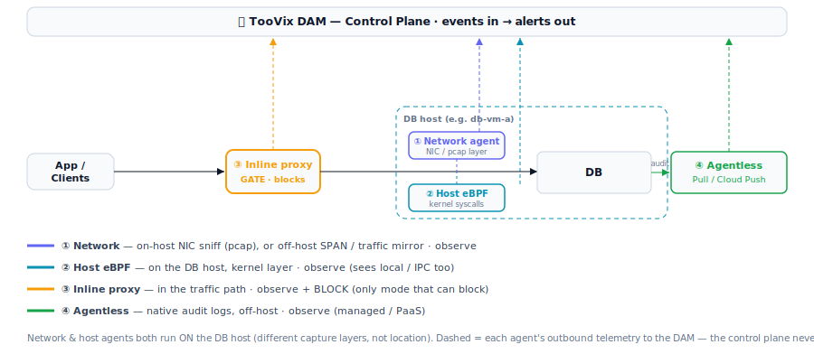

# TooVix DAM — Capture Modes

Four ways the DAM captures database activity. All feed the same pipeline (agent → collector →
ClickHouse → alerts); they differ in **where they sit** and whether they can **block** vs only
**observe**.

## The four modes
| # | Mode | Runs | Capture layer | Blocks? | Best for |
|---|------|------|---------------|---------|----------|
| ① | **Network** | **on the DB host** (NIC sniff / pcap), or **off-host** as a SPAN / traffic mirror | network / wire | ❌ observe | zero-touch or low-overhead visibility |
| ② | **Host (eBPF)** | **on the DB host** | kernel syscalls | ❌ observe | deepest visibility (sees local / IPC) |
| ③ | **Inline proxy** | **in** the app→DB path | every query | ✅ **block / quarantine** | enforcement on sensitive DBs |
| ④ | **Agentless** | **off-host** (reads native audit logs) | audit stream | ❌ observe | managed / PaaS (no host to install on) |

## Key points
- **① Network and ② Host both run ON the DB host** (e.g. a container on `db-vm-a`). They differ by
  **capture layer** — the network agent taps the NIC (libpcap), the host agent taps the kernel — **not**
  by location. The network agent can *alternatively* run **off-host** as a SPAN port / VPC traffic
  mirror (AWS Traffic Mirroring, GCP Packet Mirroring, Azure vTAP) for a fully zero-touch DB host.
- **Only the inline proxy is preventive** — it sits in the traffic path, so it's the only mode that can
  block a query in real time. The other three are detective (observe + alert).
- **Agents dial outbound** to the DAM; the control plane never connects into the DB network — which is
  why every mode works for private, no-public-IP databases (see
  [deployment-architecture.md](./deployment-architecture.md)).

## Data classification (orthogonal to capture)
Classification — discovering which columns hold PII/PCI — is **separate from the capture mode above**.
It doesn't watch traffic; it logs into the database as a **least-privilege reader** (e.g. `dam_svc` with
`SELECT`), reads `information_schema`, and matches column names against the PII/PCI pattern library
(Aadhaar, SSN, card number/CVV, email, name, DOB, phone, address, …). Matches are reported to the DAM
and populate the **Classification** page.

- **Any agent can classify**, regardless of its capture mode — network, host, or proxy. The *same* agent
  already installed on the DB host does the scan when given DB read credentials. You do **not** need a
  separate agent.
- Enable it by setting `CLASSIFY=true`, `DB_USER`, and `DB_PASSWORD` (the least-privilege reader) on the
  agent. It re-scans every `CLASSIFY_INTERVAL_MIN` minutes (default 30), once ~10s after each agent
  restart, and **on demand** when you click **Run Scan** on the Classification page (the agent polls the
  control plane every ~12s for a pending request). Uses the same outbound path — no inbound connection.
- For **agentless** / PaaS sources with no agent, the standalone **collector** performs the same scan.
- Classification is available for **MySQL** in this build; other engines are observe-only for now.
