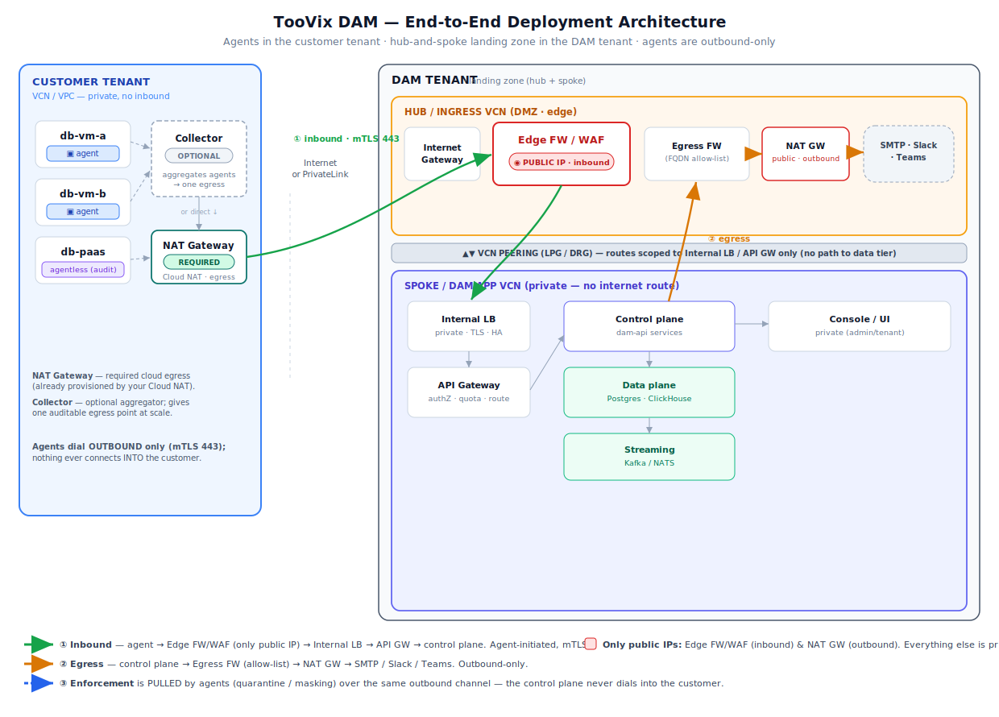

# TooVix DAM — Production Deployment Architecture

End-to-end topology: **agents run in the customer tenant**, the **DAM runs in its own tenant** as a
**hub-and-spoke landing zone**. The guiding rule is that **agents are outbound-only** — nothing ever
initiates a connection *into* the customer network, and the DAM core is never public.

---

## Zones

### Customer tenant (VCN / VPC — private)
- Database agents (`db-vm-a`, `db-vm-b`) capture activity locally; managed/PaaS DBs (`db-paas`) use the
  **agentless** audit path.
- **NAT Gateway — REQUIRED (cloud plumbing, not a DAM component).** The DB VMs sit in private subnets
  with no public IP, so the VPC needs a NAT Gateway for agents to reach the DAM outbound. This is
  standard cloud networking and is **already provisioned** in the GCP test env (`Cloud NAT` per VPC).
- **Collector — OPTIONAL (DAM component).** Instead of every agent egressing independently, one
  collector in the customer VPC aggregates local agents and makes a **single** outbound connection —
  giving one auditable egress point, batching/buffering, and one mTLS identity. Not required; agents can
  egress directly through the NAT. Worth adding at scale or when a single egress chokepoint is mandated.
- **Agents dial OUTBOUND only** (mTLS, 443). No inbound is ever opened in the customer network.

### DAM tenant — hub-and-spoke landing zone

**Hub / ingress VCN (DMZ · edge)** — the only tier with any internet footprint:
- **Edge FW / WAF** — holds the **single public IP** for inbound. Terminates/inspects TLS + mTLS, runs
  WAF, IPS, rate-limiting. This is the one hardened front door.
- **Internet Gateway** — the on-ramp the edge FW's public IP routes through.
- **Egress FW + NAT Gateway** — outbound-only path for the DAM's own egress (email / Slack / Teams,
  license checks, cloud audit-log pulls). The egress FW allow-lists destinations; the NAT GW does the
  address translation. This is the *second* (and only other) public IP in the estate, and it's
  outbound-only — you never route inbound to it.

**VCN peering (LPG / DRG)** — connects hub↔spoke with **routes scoped to the Internal LB / API GW
only**. There is deliberately **no route from the DMZ to the data tier**.

**Spoke / DAM app VCN (private — no internet route):**
- **Internal LB** (private) — TLS offload, health checks, HA across backends. Not public.
- **API Gateway** (private) — authZ, quota, routing.
- **Control plane** (`dam-api` services), **Data plane** (Postgres · ClickHouse), **Streaming**
  (Kafka / NATS), **Console / UI** — all private, each gated by its own NSG (defense in depth). The
  data + streaming subnets have **no internet route at all**.

---

## Flows

1. **① Inbound** — `agent → Edge FW/WAF (only public IP) → Internal LB → API GW → control plane`.
   Always agent-initiated, mTLS. High-volume event ingest can use a separate ingest backend behind the
   same edge to keep the API GW lean.
2. **② Egress** — `control plane → Egress FW (allow-list) → NAT GW → SMTP / Slack / Teams`.
   Outbound-only, centralized in the hub so there's one inspected egress point.
3. **③ Enforcement is pulled** — agents `GET /api/agents/quarantine-list` and `/masking-policy` over the
   same outbound channel. Because block/mask rules are **pulled**, the control plane **never dials into
   the customer** — which is what lets the entire DAM sit privately behind the peering.

---

## Key properties
- **Only two public IPs** in the whole estate: the **Edge FW/WAF** (inbound) and the **NAT GW**
  (outbound). Everything else — Internal LB, API GW, control plane, data, streaming, UI — is private.
- **No public Load Balancer** — the LB moves *inside* the spoke and is private; the edge FW/WAF is the
  single public chokepoint.
- **Zero inbound to the customer.** Firewalls on both sides need egress rules only.
- **Zero-internet option:** publish the agent-ingress as a **private endpoint** (PrivateLink / PSC /
  OCI Private Endpoint) per customer, or rendezvous both sides on a managed message bus — same
  outbound-from-agent model, no public exposure.

> For local testing the agent's `dam_control_plane_url` points at a tunnel (Cloudflare Tunnel / ngrok)
> that stands in for the edge FW/WAF ingress FQDN. In production you swap that URL for the real ingress
> hostname; the agent config is otherwise unchanged.
