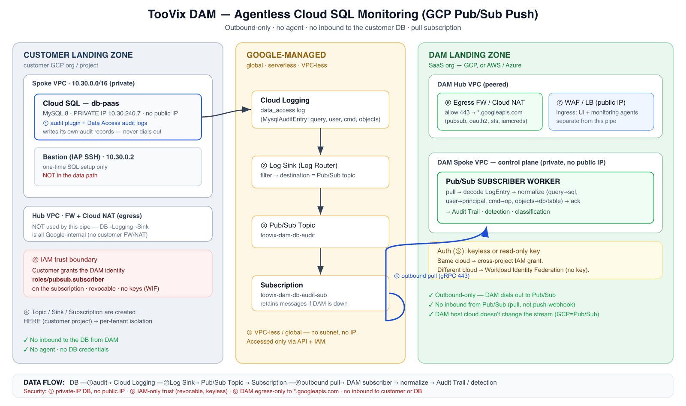

# SOP — Agentless Monitoring of a GCP Cloud SQL (PaaS) Database via Pub/Sub Push

**Purpose:** Onboard a managed **GCP Cloud SQL (MySQL)** database into TooVix DAM **agentlessly** —
no agent on the DB, no inbound path into the customer network. The DB emits audit records to Cloud
Logging; a Log Sink pushes them to a Pub/Sub topic; the DAM **pulls** the subscription outbound.

**Audience:** Cloud/DB admin (customer side) + DAM operator (platform side).
**Scope:** GCP Cloud SQL for MySQL 8.0. (Postgres/SQL Server, AWS RDS, Azure SQL are analogous — different
audit source + stream service; see Appendix C.)

---

## 1. Architecture (detailed) + security touchpoints



<sub>(Text version below; editable Word copy: `TooVix-DAM-SOP-Agentless-Cloud-SQL-PubSub.docx`)</sub>

```
        CUSTOMER LANDING ZONE (their GCP org/project)                 GOOGLE-MANAGED (global,          DAM LANDING ZONE (SaaS org — GCP or AWS/Azure)
                                                                        serverless, VPC-less)
 ┌───────────────────────────────────────────────────────┐                                      ┌────────────────────────────────────────────────────┐
 │  Spoke VPC  (10.30.0.0/16)                             │                                      │  DAM Spoke VPC (private)                             │
 │  ┌─────────────────────────┐                          │        ┌───────────────────┐         │   ┌──────────────────────────────────────────┐      │
 │  │ Cloud SQL: db-paas      │  audit plugin            │        │  Cloud Logging    │         │   │ DAM control plane (private, no public IP)  │      │
 │  │ MySQL 8, PRIVATE IP     │──(1) cloudsql_mysql_audit│──────► │  data_access log  │         │   │  • API / UI  • detection  • Audit Trail     │      │
 │  │ 10.30.240.7  (no pub IP)│    +Data Access audit    │        │  (MysqlAuditEntry)│         │   │  • Pub/Sub SUBSCRIBER WORKER  ◄────────────┼──┐   │
 │  └─────────────────────────┘                          │        └─────────┬─────────┘         │   └──────────────────────────────────────────┘  │   │
 │  ┌─────────────────────────┐                          │                  │ (2) Log Sink       │              ▲ (7) inbound: UI + agents         │(6)│
 │  │ Bastion (IAP SSH only)  │  admin/setup only —      │                  ▼   (filter)          │              │  via WAF/LB ingress (hub DMZ)    │out│
 │  │ 10.30.0.2  NOT data path│  not in the data flow    │        ┌───────────────────┐         │   ┌──────────┴───────────────┐                  │bnd│
 │  └─────────────────────────┘                          │        │  Pub/Sub TOPIC    │         │   │ DAM Hub VPC (peered)      │                  │   │
 │                                                        │        │  toovix-dam-db-   │         │   │  • WAF / LB (public IP)   │  (7)             │   │
 │  Hub VPC: FW + Cloud NAT (customer egress)             │        │  audit            │         │   │  • Egress FW / Cloud NAT ──┼──(6) outbound────┘   │
 │   └─ NOT used by this data path (all Google-internal)  │        └─────────┬─────────┘         │   │     443 to *.googleapis.com                     │
 │                                                        │                  │                    │   └───────────────────────────┘                     │
 │  IAM (5): grant DAM identity roles/pubsub.subscriber   │        ┌─────────▼─────────┐         │                                                      │
 │           on the SUBSCRIPTION (cross-org binding)      │◄───────│  SUBSCRIPTION     │◄────────┼──(6) DAM pulls (streaming/synchronous)  outbound     │
 │                                                        │  (3)   │  ...-sub          │  gRPC   │      gRPC/HTTPS 443 → pubsub.googleapis.com          │
 └───────────────────────────────────────────────────────┘        └───────────────────┘         └──────────────────────────────────────────────────────┘
        (4) topic/sink/sub created HERE (customer project)                                              Auth (5): keyless WIF (cross-cloud) or read-only SA key

 DATA FLOW (agentless, PUSH-to-topic + PULL-by-DAM):
   DB ─(1)audit→ Cloud Logging ─(2)Log Sink→ Pub/Sub Topic → Subscription ─(6)outbound pull→ DAM subscriber → normalize → Audit Trail / detection
```

### Security touchpoints (keyed to the diagram)

| # | Touchpoint | Configuration | Direction / exposure |
|---|---|---|---|
| **1** | **Cloud SQL audit** | `cloudsql_mysql_audit=ON` flag + audit rule; **Data Access audit logs enabled**. DB has **private IP, no public IP**. | Internal to Google — DB never opens outbound to DAM. |
| **2** | **Log Sink (Log Router)** | Filter selects Cloud SQL audit records → destination = Pub/Sub topic. Auto-created **writer identity**. | Google-internal; no network path. |
| **3** | **Pub/Sub topic + subscription** | Managed, **VPC-less, global**. Lives in the **customer's project** (next to the logs). | No IP/subnet; accessed only via the API + IAM. |
| **4** | **Resource ownership** | Topic/sink/subscription created in the **customer project** — per-tenant isolation; a tenant's audit never shares a pipe. | — |
| **5** | **IAM grant (the trust boundary)** | Customer grants **the DAM's identity** `roles/pubsub.subscriber` on **their** subscription. Sink writer granted `pubsub.publisher` on the topic. **No keys shared if using WIF.** | Identity-based, not network. Revocable anytime. |
| **6** | **DAM egress (the only network path)** | DAM subscriber **dials out** 443 (gRPC) to `pubsub.googleapis.com`. DAM **hub egress FW / Cloud NAT** allowlists `*.googleapis.com` (+ `oauth2`, `sts`, `iamcredentials` for keyless). **No inbound from Pub/Sub** (pull model). | Outbound-only. |
| **7** | **DAM ingress (separate from this pipe)** | UI + monitoring agents reach the control plane via the **DAM hub WAF/LB (public)** → private DAM. Not used by the Pub/Sub pull. | Inbound, but unrelated to agentless ingest. |

**Key security properties**
- **No inbound to the customer DB or network** from the DAM — ever. (Pull, not push-webhook.)
- **No agent, no DB credentials** for monitoring — the DB writes its own audit; the DAM only reads a stream.
- **No customer NAT/FW change** for the data path — DB→Logging→Sink→Pub/Sub is all Google-internal.
- **Only the DAM landing zone needs egress** to `*.googleapis.com`.
- **Least privilege:** the DAM identity holds only `pubsub.subscriber` on one subscription (+ read-only
  discovery roles). Delete the subscription/IAM binding to offboard a tenant — nothing else affected.

---

## 2. Prerequisites
- Customer: `roles/cloudsql.admin` (flags + audit), `roles/logging.configWriter` (sink), `roles/pubsub.admin`
  (topic/sub), and project IAM admin (Data Access audit config + granting the DAM identity).
- A reachable **admin path to the DB** for the one-time SQL step (private IP → a bastion via IAP, or Cloud SQL Auth Proxy).
- The **DAM's identity** to grant: either
  - a **read-only service account** the customer creates, or
  - the DAM's **Workload Identity Federation** principal (keyless, recommended cross-cloud), or
  - (same-project lab only) the DAM VM's attached service account.
- Pub/Sub API enabled in the customer project (`gcloud services enable pubsub.googleapis.com`).

Set once:
```bash
PROJECT=YOUR_PROJECT_ID
INSTANCE=db-paas
TOPIC=toovix-dam-db-audit
SUB=toovix-dam-db-audit-sub
DAM_IDENTITY="serviceAccount:dam-collector@DAM_PROJECT.iam.gserviceaccount.com"   # or the WIF principal
```

---

## PART A — Customer side: turn on audit → Pub/Sub

### A1. Enable the Cloud SQL audit plugin (⚠ restarts the instance)
```bash
gcloud sql instances patch $INSTANCE \
  --database-flags=cloudsql_mysql_audit=ON,cloudsql_mysql_audit_log_write_period=1
```
- Value is **uppercase `ON`**. `--database-flags` **replaces** the whole set — list all flags together.
- `cloudsql_mysql_audit_log_write_period=1` flushes buffered audit records ~every second (lower latency).

### A2. Create the audit rule (inside MySQL)
Connect via the bastion (private IP) as the Cloud SQL admin user:
```bash
mysql -h <PRIVATE_IP> -u admin -p
```
```sql
CALL mysql.cloudsql_create_audit_rule('`%`@`%`', '`%`', '`%`', 'connect,dql,dml,ddl,dcl', 'B', 1, @rc, @msg);
SELECT @rc, @msg;   -- 0 / NULL = success
```
Gotchas: **8 arguments**; wildcards **backtick-quoted** (`` `%`@`%` ``, `` `%` ``); `op_result='B'` (both
success+fail); `ops` are **categories** (`connect,dql,dml,ddl,dcl`), not `all`. Verify: `SELECT * FROM mysql.audit_log_rules;`

### A3. Enable Data Access audit logs (⚠ REQUIRED for user-data queries)
Without this, only admin/system queries are logged; **reads/writes on user tables won't appear**.
```bash
gcloud projects get-iam-policy $PROJECT --format=json > policy.json
python3 - <<'PY'
import json
f='policy.json'; p=json.load(open(f))
acs=[c for c in p.get('auditConfigs',[]) if c.get('service')!='cloudsql.googleapis.com']
acs.append({'service':'cloudsql.googleapis.com',
            'auditLogConfigs':[{'logType':'DATA_READ'},{'logType':'DATA_WRITE'}]})
p['auditConfigs']=acs; json.dump(p,open(f,'w'))
PY
gcloud projects set-iam-policy $PROJECT policy.json
```
> Data Access audit config changes can take **several minutes (up to ~10)** to propagate.

### A4. Create the Pub/Sub topic
```bash
gcloud pubsub topics create $TOPIC --project=$PROJECT
```

### A5. Create the Log Sink → topic
```bash
gcloud logging sinks create toovix-dam-db-audit-sink \
  pubsub.googleapis.com/projects/$PROJECT/topics/$TOPIC --project=$PROJECT \
  --log-filter='resource.type="cloudsql_database" AND protoPayload.methodName="cloudsql.instances.query"'
```
(One sink per project covers **all** Cloud SQL instances there; the DAM tells them apart from each message.)

### A6. Let the sink publish to the topic
```bash
SINK_SA=$(gcloud logging sinks describe toovix-dam-db-audit-sink --project=$PROJECT --format='value(writerIdentity)')
gcloud pubsub topics add-iam-policy-binding $TOPIC --project=$PROJECT --member="$SINK_SA" --role="roles/pubsub.publisher"
```

### A7. Create the subscription
```bash
gcloud pubsub subscriptions create $SUB --topic=$TOPIC --project=$PROJECT \
  --ack-deadline=30 --message-retention-duration=7d
# (optional) dead-letter:
# gcloud pubsub topics create ${TOPIC}-dlq --project=$PROJECT
# gcloud pubsub subscriptions update $SUB --project=$PROJECT --dead-letter-topic=${TOPIC}-dlq --max-delivery-attempts=5
```

### A8. Grant the DAM identity subscriber (the trust boundary)
```bash
gcloud pubsub subscriptions add-iam-policy-binding $SUB --project=$PROJECT \
  --member="$DAM_IDENTITY" --role="roles/pubsub.subscriber"
```
That single cross-org IAM binding is the *entire* connection — no VPC, no peering, no inbound.

---

## PART B — DAM side: register the connector + subscription
In the DAM UI: **Discovery → Cloud connectors → Connect a cloud**:
- Provider **GCP**, project = `$PROJECT`.
- Credential: **Keyless** (recommended — WIF/attached identity) or paste a read-only SA key.
- **Pub/Sub subscription:** `toovix-dam-db-audit-sub` (or the full `projects/$PROJECT/subscriptions/...`).
- Save. The DAM's subscriber loop begins pulling; the connector row shows **Agentless ingest = streaming**.

(API equivalent: `POST /api/discovery/connectors { provider:"gcp", keyless:true, project, subscription }`.)

---

## PART C — Network / landing-zone configuration

**Customer landing zone**
- Cloud SQL: **private IP, no public IP**. **No FW rule** and **no NAT** are needed for this pipe — the
  DB→Logging→Sink→Pub/Sub path is entirely Google-internal.
- The **bastion** is only for the one-time A2 SQL step (IAP SSH); it is **not** in the data path.

**DAM landing zone**
- DAM control plane sits **private** behind the hub.
- **Egress (touchpoint 6):** the hub **Egress FW / Cloud NAT** must **allow outbound 443** from the DAM
  subnet to: `pubsub.googleapis.com`, `oauth2.googleapis.com`, and (keyless) `sts.googleapis.com`,
  `iamcredentials.googleapis.com`. DNS resolution for `*.googleapis.com` via the hub.
- **No inbound** rule for Pub/Sub (pull model). **Ingress (touchpoint 7)** — the public **WAF/LB → private
  DAM** — exists for the UI + monitoring agents and is unrelated to this agentless pipe.
- **DAM on AWS/Azure:** identical, plus the subscriber authenticates to GCP via **Workload Identity
  Federation** (its AWS/Azure identity → short-lived GCP token); that token exchange is also outbound 443
  through the landing-zone egress FW. Still **no inbound**.

---

## PART D — Validation
1. Fire an audited user query on the DB (via bastion): `SELECT * FROM <db>.<table> LIMIT 5;`
2. Confirm it reached Cloud Logging:
   ```bash
   gcloud logging read 'resource.type="cloudsql_database" AND protoPayload.methodName="cloudsql.instances.query"' \
     --project=$PROJECT --limit=5 --freshness=10m --format='value(timestamp, protoPayload.request.user, protoPayload.request.query)'
   ```
3. Confirm it reached the subscription (optional): `gcloud pubsub subscriptions pull $SUB --project=$PROJECT --limit=3`
4. Confirm it landed in the DAM: **Audit Trail → Database Activity** shows the query with `source_host` = the
   instance and (Instance/Host) the registered instance. Connector shows `ingest_status = ok`.

---

## PART E — Troubleshooting (issues we actually hit)
| Symptom | Cause | Fix |
|---|---|---|
| `on was not an expected string` (flag) | Flag value must be **uppercase** | Use `cloudsql_mysql_audit=ON` |
| `zsh: unknown file attribute: *` | Ran the `CALL` in the **shell** | Run it **inside `mysql>`** |
| `expected 8, got 6` / `op_result should be 'S'/'U'/'B'/'E'` / `Special characters only between backticks` / `operation "all" not supported` | Wrong `create_audit_rule` args | 8 args; `op_result='B'`; backtick wildcards; ops = `connect,dql,dml,ddl,dcl` |
| Pull error: *Pub/Sub API not enabled* | API just enabled | `gcloud services enable pubsub.googleapis.com`; wait a few min (loop retries) |
| **System queries flow, but user-table queries don't** | **Data Access audit logs OFF** (`auditConfigs` null) | Do **A3**; wait for propagation (~10 min) |
| Records lag / appear in bursts | Audit buffer flush period | Set `cloudsql_mysql_audit_log_write_period=1` (A1) |
| Access denied connecting as admin | Cloud SQL admin user is `admin` (not `root`); secret mismatch | `gcloud sql users set-password admin --host=% --instance=$INSTANCE --password=…` |

---

## Appendix A — Least-privilege IAM summary (what the DAM holds)
| Purpose | Role | On |
|---|---|---|
| Cloud discovery (list instances) | `roles/cloudsql.viewer` | project |
| (Pull path) consume audit stream | `roles/pubsub.subscriber` | the subscription |
| (If reading logs directly instead of Pub/Sub) | `roles/logging.viewer` + `roles/logging.privateLogViewer` | project |

No write roles, no DB credentials, no network access into the customer VPC.

## Appendix B — Offboarding a tenant
Delete the **subscription** (stops the DAM pulling) and/or **revoke** the `pubsub.subscriber` binding.
Optionally remove the sink, topic, audit rule, and turn off the flag/Data-Access-audit. Nothing else is affected.

## Appendix C — Other clouds (same pattern, different source + stream)
| DB cloud | Audit source | Stream | DAM consumer |
|---|---|---|---|
| GCP Cloud SQL | Cloud Logging (data_access) | **Pub/Sub** | pull subscriber |
| Azure SQL / MySQL / PG | Diagnostic Settings | **Event Hub** | Event Hub consumer |
| AWS RDS / Aurora | CloudWatch Logs | **Kinesis** | Kinesis consumer |
| OCI | OCI Audit / Logging | **OCI Streaming** | Streaming consumer |
The DB cloud dictates the stream service; the DAM is a multi-cloud consumer (one adapter per stream). Its
own hosting cloud doesn't change any of the above — only its **egress** target + **auth** (WIF cross-cloud).
